<div align="center">


<h1>TOEFL Prep Studio</h1>

<p><strong>TOEFL iBT 2026 · Local practice, mock exams, and review</strong></p>
<p>English questions, Chinese explanations. Practice all four sections and keep your work on your own computer.</p>

<p>
  <a href="docs/technical/development.md"></a>
  
  <a href="LICENSE.md"></a>
</p>

<p><a href="README.md">简体中文</a> · <strong>English</strong></p>

<p>
  <a href="#quick-start">Quick start</a> ·
  <a href="#practice-and-review">Practice and review</a> ·
  <a href="#question-bank">Question bank</a> ·
  <a href="#task-previews">Task previews</a> ·
  <a href="#usage-notes">Usage notes</a> ·
  <a href="#documentation">Documentation</a> ·
  <a href="https://github.com/AuroraWhisperer/toefl-prep-studio/releases">Releases (v1.1.0)</a>
</p>

</div>

**New in v1.1.0:** Each Reading and Listening task pool has doubled, bringing the original bank to 3,615 items. This release revises questions and explanations, marks open writing and interview responses for manual review, and improves review typography. See the [release notes](docs/releases/v1.1.0.md).

## Quick start

You need **Windows, Python 3.10+, and a desktop browser**. Download and extract the source, then double-click **[TOEFL Prep Studio.cmd](<TOEFL Prep Studio.cmd>)** in the project root.

On the first run, the launcher creates a Python environment, installs dependencies, and opens the [local workbench](http://127.0.0.1:38761/) once the service is ready. If the service is already running, it opens the page directly. Everyday use requires no Node.js or frontend build.

<details>
<summary><strong>Prefer the command line? Start from PowerShell</strong></summary>

Run these commands from the project root:

```powershell
python -m venv .venv
.\.venv\Scripts\python.exe -m pip install -r requirements.txt
.\.venv\Scripts\python.exe scripts/launch.py
```

For later launches, run only the last line. See the [development guide](docs/technical/development.md) for configuration and startup troubleshooting.

</details>

> **First session:** Pick a section and start task or section practice. The original question bank is included, and comprehensive tests are ready to use. ETS mock exams require a separate [local import of papers you are entitled to use](question_bank/README.md#模考导入与隔离); official materials are not included in the public source.

Keep the service window open while practicing; minimizing it is fine. Closing it stops the service, but closing the browser page does not. The first installation needs internet access, and recording requires microphone permission in your browser.

## Practice and review

Use task practice to work on a particular question type, or section practice to work on pacing. For a full run through all four sections, choose a mock exam or a comprehensive test.

<table>
  <thead>
    <tr>
      <th width="200" align="center" valign="middle">Mode</th>
      <th width="250" align="center" valign="middle">When to use it</th>
      <th width="550" align="center" valign="middle">What you do</th>
    </tr>
  </thead>
  <tbody>
    <tr>
      <td align="center" valign="middle"><strong>Task practice</strong></td>
      <td align="center" valign="middle">Focus on one task type</td>
      <td align="center" valign="middle">Choose the quantity and timer. Practice with randomly selected, complete passages, conversations, or interviews.</td>
    </tr>
    <tr>
      <td align="center" valign="middle"><strong>Section practice</strong></td>
      <td align="center" valign="middle">Get used to a section's pace</td>
      <td align="center" valign="middle">Complete a fixed set within the section time limit, then review your submission.</td>
    </tr>
    <tr>
      <td align="center" valign="middle"><strong>Mock exams</strong></td>
      <td align="center" valign="middle">Follow a published paper from start to finish</td>
      <td align="center" valign="middle">Locally import ETS Practice Tests 1–5, with 97 questions per form.</td>
    </tr>
    <tr>
      <td align="center" valign="middle"><strong>Comprehensive tests</strong></td>
      <td align="center" valign="middle">Practice all four sections at a chosen difficulty</td>
      <td align="center" valign="middle">Take 120 questions from the original bank. Choose one of five profiles and a starting level from 1–10; Reading and Listening adjust material selection between modules.</td>
    </tr>
  </tbody>
</table>

After submitting, compare your responses and reference answers with the original material. Learning notes follow **“Understand → Reason → Try next time”**: identify the key cue, see why an answer works, and take away a method for the next question.

Answers, time spent, feedback, and uploaded recordings are saved locally. Find a previous session by category or date to revisit an explanation or listen to a recording. Saved mock exams and comprehensive tests can also be resumed.

<details>
<summary><strong>More about sampling, timers, and audio</strong></summary>

- **Sampling:** Task practice keeps materials intact and avoids repeats within a round. Materials you have already submitted are less likely to appear again.
- **Timers:** Reading, Listening, and Writing task practice offer count-up and countdown timers. Speaking uses a countdown.
- **Answering:** Fill missing letters directly in the passage. Build sentences by selecting, dragging, and removing word tiles.
- **Audio:** Synthesized prompts support multiple English accents and distinct dialogue voices. Speaking includes microphone recording, playback, and text transcription.

</details>

## Question bank

The original bank contains **3,615 practice items across 12 task types**. Every Reading and Listening task pool has doubled from the previous version. A subsequent review of all 3,000 Reading and Listening items revised topics, answers, distractors, and explanations; difficulty follows the actual task demands, without fixed proportions. See the [expansion details](docs/question-bank/receptive-expansion-2026-09-30.md) and [item-by-item revision report](docs/question-bank/receptive-repair-2026-09-30.md). “Section set” below is the number of items in one fixed section practice session.

| Section | Bank items | Section set | Task types |
| :--- | ---: | ---: | :--- |
| **Reading** | **1,590** | 50 | Complete the Words<br>Read in Daily Life · Read an Academic Passage |
| **Listening** | **1,410** | 47 | Choose a Response · Conversation<br>Announcement · Academic Talk |
| **Writing** | **450** | 12 | Build a Sentence · Write an Email<br>Academic Discussion |
| **Speaking** | **165** | 11 | Listen and Repeat · Take an Interview |

ETS mock papers are stored separately and excluded from original-practice sampling. Question content and answer keys are kept apart, with scoring handled by the server. See the [question-bank guide](question_bank/README.md) for sources, review requirements, and generation procedures.

## Task previews

These screenshots show original practice questions in the app. Expand a section and click an image to enlarge it. Each crop keeps the question, essential material, and relevant answer controls; speaking previews have the practice script expanded so you can read the prompt.

<details open>
<summary><strong>Reading · 3 task types</strong></summary>

<p align="center"><strong>Complete the Words</strong></p>
<p align="center">
  <a href="docs/assets/questions/reading-complete-words.png">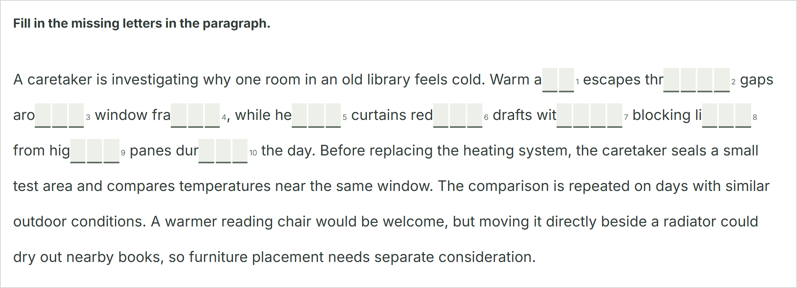</a>
</p>

<p align="center"><strong>Read in Daily Life</strong></p>
<p align="center">
  <a href="docs/assets/questions/reading-daily-life.png">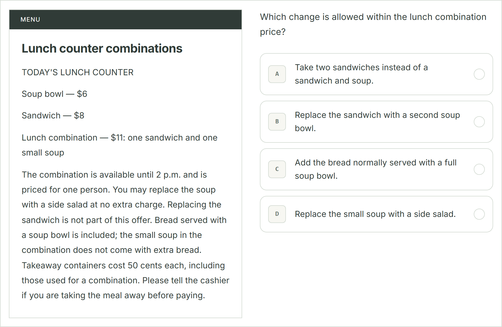</a>
</p>

<p align="center"><strong>Read an Academic Passage</strong></p>
<p align="center">
  <a href="docs/assets/questions/reading-academic-passage.png">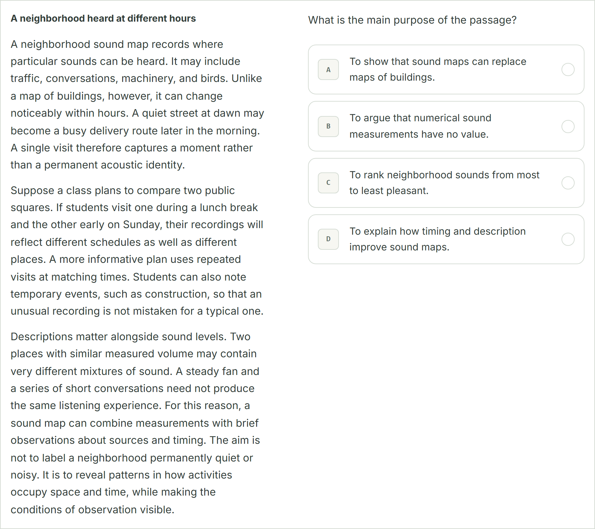</a>
</p>

</details>

<details>
<summary><strong>Listening · 4 task types</strong></summary>

<p align="center"><strong>Choose a Response</strong></p>
<p align="center">
  <a href="docs/assets/questions/listening-choose-response.png">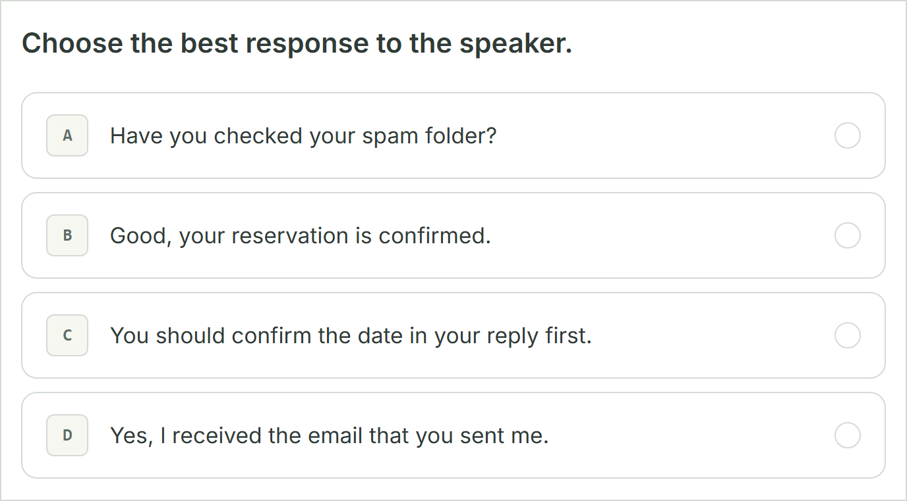</a>
</p>

<p align="center"><strong>Conversation</strong></p>
<p align="center">
  <a href="docs/assets/questions/listening-conversation.png">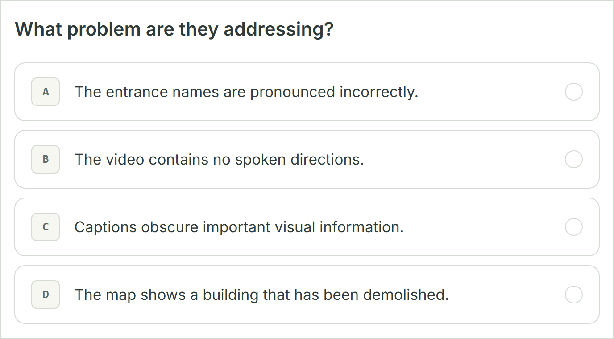</a>
</p>

<p align="center"><strong>Announcement</strong></p>
<p align="center">
  <a href="docs/assets/questions/listening-announcement.png">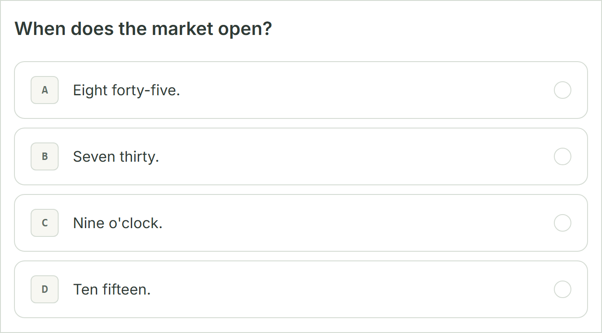</a>
</p>

<p align="center"><strong>Academic Talk</strong></p>
<p align="center">
  <a href="docs/assets/questions/listening-academic-talk.png">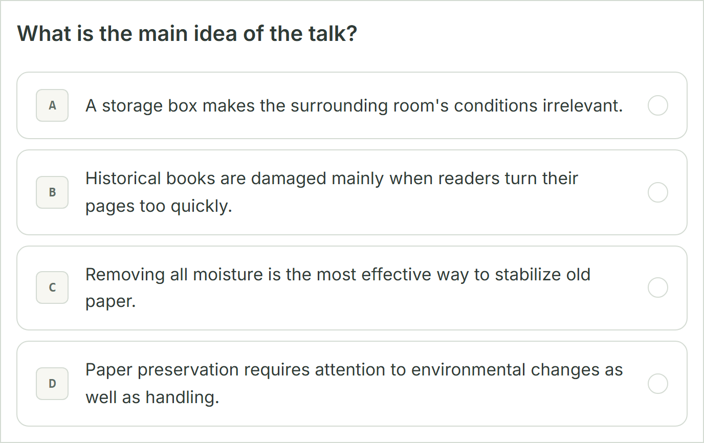</a>
</p>

</details>

<details>
<summary><strong>Writing · 3 task types</strong></summary>

<p align="center"><strong>Build a Sentence</strong></p>
<p align="center">
  <a href="docs/assets/questions/writing-build-sentence.png">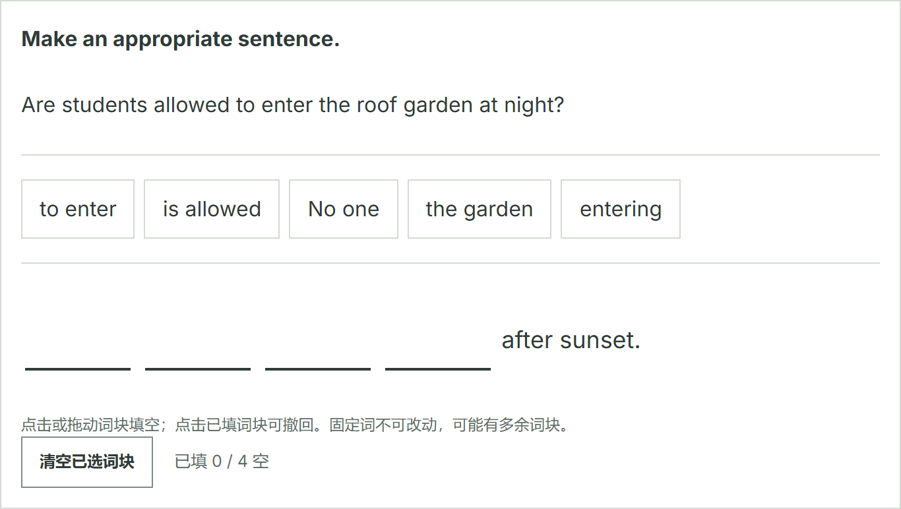</a>
</p>

<p align="center"><strong>Write an Email</strong></p>
<p align="center">
  <a href="docs/assets/questions/writing-email.png">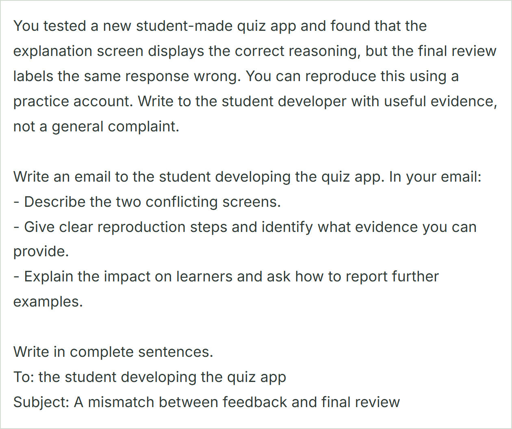</a>
</p>

<p align="center"><strong>Write for an Academic Discussion</strong></p>
<p align="center">
  <a href="docs/assets/questions/writing-academic-discussion.png">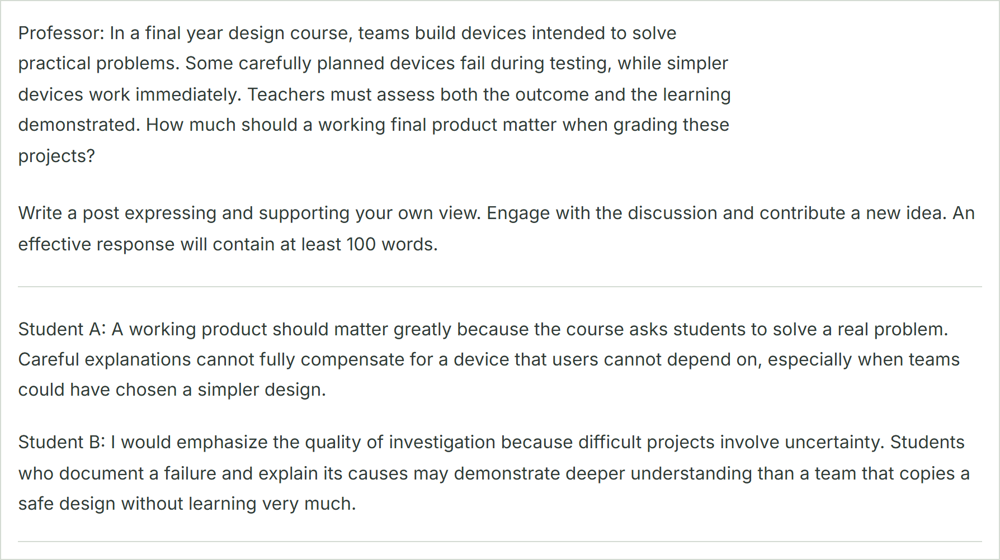</a>
</p>

</details>

<details>
<summary><strong>Speaking · 2 task types</strong></summary>

<p align="center"><strong>Listen and Repeat</strong></p>
<p align="center">
  <a href="docs/assets/questions/speaking-listen-repeat.png">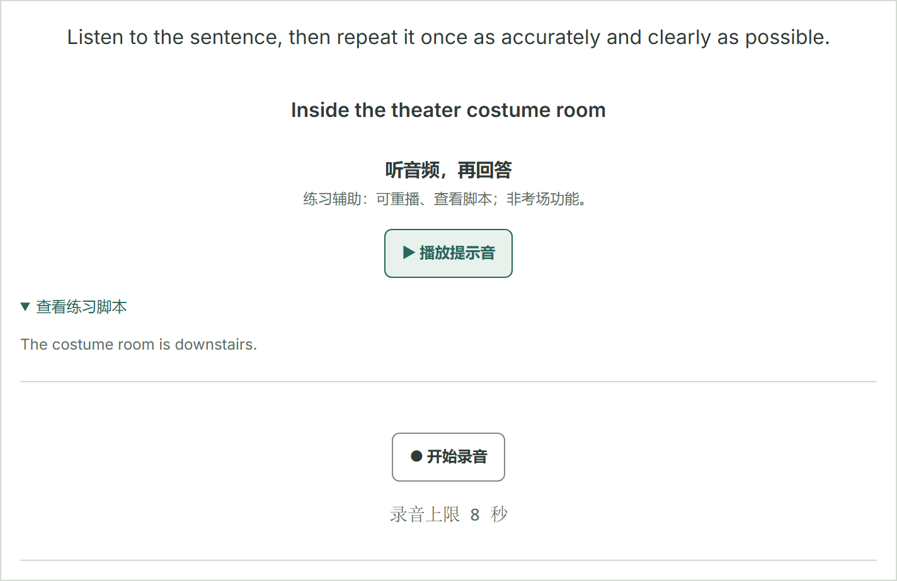</a>
</p>

<p align="center"><strong>Take an Interview</strong></p>
<p align="center">
  <a href="docs/assets/questions/speaking-interview.png"></a>
</p>

</details>

## Usage notes

The interface is primarily in Chinese and targets **2560×1440 desktop displays with 125% or 150% Windows scaling**. A maximized browser window works best.

<details>
<summary><strong>What happens if I leave or refresh the page?</strong></summary>

Regular practice is archived after a successful submission. Back and Forward retain the current round within the same tab. **Refreshing discards unsubmitted work** and returns you to setup or home.

Mock exams and comprehensive tests can resume saved progress, but their timers do not pause or reset when you leave or refresh. Answers and review are available only after you complete the test.

Screens have their own paths, such as `/practice/reading`, `/history`, and `/tests`. Archived reviews and saved exam sessions can be opened directly. See [navigation behavior](docs/technical/architecture.md#页面路径与浏览器导航) for paths and recovery limits.

</details>

<details>
<summary><strong>Where are my records and recordings stored?</strong></summary>

Data is saved under the local `artifacts/` directory by default. Set `TOEFL_DATA_DIR` before starting the service to use a different location. See [storage and recovery](docs/technical/architecture.md#存储与归档) for details.

If a recording upload fails, retry before leaving the page.

</details>

<details>
<summary><strong>Do listening and speaking need internet access?</strong></summary>

Prompts use an online speech service first, with a matching browser voice as a fallback. Mock exam audio is synthesized from the paper's scripts. Running locally does not mean everything works offline.

Speech recognition depends on browser support. You can correct a transcript manually or enter text yourself.

</details>

<details>
<summary><strong>How should I interpret the scores?</strong></summary>

Regular practice totals only automatically checked items. Emails, discussions, and interviews are marked for manual review, with word-count and repetition hints but no grades based on reference keywords. Repetition tasks compare transcripts only. Mock exams and comprehensive tests report objective correct-answer counts; open writing responses and speaking tasks need manual review. Existing records retain their original scores and feedback.

These results are for practice. **They do not predict official scores or assess pronunciation, intonation, or fluency.** Difficulty levels, module routing, and some time limits are local training settings. Mock exam learning notes are written for this project, not supplied by ETS.

</details>

## Documentation

For a closer look at a feature or before changing the code, start with the relevant guide. Technical and question-bank documentation is currently in Chinese.

<table>
  <thead>
    <tr>
      <th width="300" align="left">Document</th>
      <th width="700" align="left">What you will find</th>
    </tr>
  </thead>
  <tbody>
    <tr><td><a href="docs/technical/development.md"><strong>Development guide</strong></a></td><td>Environment setup, startup troubleshooting, tests, and formatting</td></tr>
    <tr><td><a href="PRODUCT.md"><strong>Product specification</strong></a></td><td>Feature behavior, practice rules, and scope</td></tr>
    <tr><td><a href="DESIGN.md"><strong>Design specification</strong></a></td><td>Visual language, layouts, and keyboard and mouse interaction</td></tr>
    <tr><td><a href="docs/technical/architecture.md"><strong>System architecture</strong></a></td><td>Stack, module responsibilities, data flow, and storage</td></tr>
    <tr><td><a href="docs/technical/api.md"><strong>API reference</strong></a></td><td>Practice, exams, history, and speech endpoints</td></tr>
    <tr><td><a href="question_bank/README.md"><strong>Question-bank guide</strong></a></td><td>Sources, review, generation, and mock paper import</td></tr>
    <tr><td><a href="AGENTS.md"><strong>Development conventions</strong></a></td><td>Change scope, data protection, and verification requirements</td></tr>
  </tbody>
</table>

## Important notes

### Noncommercial use; commercial use requires separate written permission

Original code and content use the [noncommercial license](LICENSE.md): **source available, not a standard open-source license**.

- **Permitted uses:** Noncommercial learning, research, modification, and sharing under the license terms.
- **Permission required:** Sales, paid hosting, commercial teaching, business use, advertising, and other commercial exploitation.
- **When sharing:** Retain license and copyright notices, identify changes, and provide corresponding source.

ETS materials, fonts, third-party dependencies, and personal data **are not covered by this permission**. The full [LICENSE.md](LICENSE.md) controls. See [third-party notices](THIRD_PARTY_NOTICES.md) for third-party rights and [distribution boundaries](docs/distribution.md) for distribution and previously published Git history.
