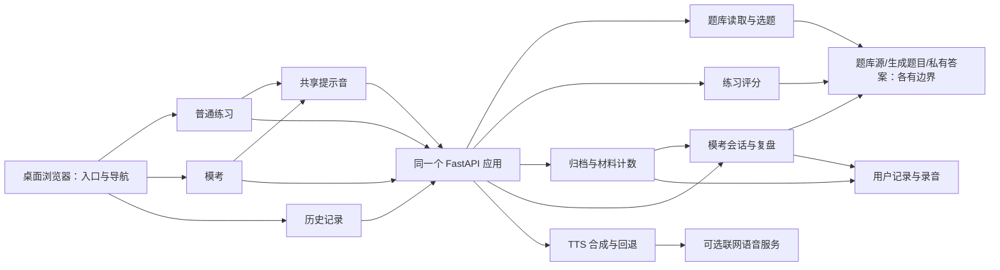

# TOEFL 练习工作台：目录与架构改进报告

评估日期：2026-09-27（Asia/Shanghai）  
评估对象：`C:\Users\Tom\Desktop\toefl_shadowing_trainer`  
状态：阶段 0–1 已完成；归档诊断、最小模考业务抽取、内存索引及测试隔离修正已实施，最终后端 294 项、浏览器全量 122 项及阅读更新增量 4 项均通过，按调整后的范围完成验收。用户已取消开发阶段备份及旧基线对照要求；早期失败证据保留，不再作为阻塞项。未搬迁目录、迁数据库或清理原数据。评估正文保留审查时点的事实与建议；当前 A–H 适用判断与验证证据见[实施与验收记录](architecture-implementation-2026-09-27.md)，首批细节见[阶段 0–1 记录](superpowers/plans/2026-09-27-architecture-first-batch.md)。

## 1. 结论摘要

**建议保留 FastAPI + 原生 HTML/CSS/JavaScript 的本地单体应用，做分阶段的小规模整理，而不是换框架或增加大量技术分层。**

最值得改进的顺序：

1. 先确认项目的 Git 边界和可恢复备份，尤其是历史记录与录音。
2. 先修正文档事实与导航，不把目录迁移或测试分组当作完成条件。
3. 代码改动单独安排：先验证具体问题，再对拥有该职责的模块做最小调整；触发条件、范围与验收见第 5–7 节。

“同类型放一起”应主要理解为**同一功能、同一生命周期、经常一起修改的内容放在一起**，而不是只按文件扩展名归类。成功标准是更容易定位、更少改错、能回滚，不是文件总数最少。

## 2. 范围、方法与限制

- 以现有 AGENTS、README、PRODUCT、DESIGN 和题库维护约定为边界：个人 Windows 桌面浏览器、本地服务、保留现有技术栈，不增加移动端、多人账户、云部署。
- 静态检查前后端入口、导入与事件关系、存储路径、题库来源、测试配置和文档引用；没有读取用户答题正文或录音内容。
- 对标 Lute、Kolibri、Anki 的官方仓库或维护者文档，并以 FastAPI、MDN 官方技术说明校准实现建议。它们是相关学习软件，**不是三个同规模的 TOEFL 产品**；样本用于借鉴边界设计，不代表行业普查。
- 本报告区分“已观察事实”“风险推断”和“建议”。没有开展性能基准、完整安全审计或真实麦克风/在线语音质量验证。没有启动、停止或重启用户服务。
- 外部文档按访问日记录；`develop`、`latest` 和主分支是可变来源。Lute 架构 Wiki 页面标示最后编辑于 2023-12-23，开发 Wiki 为 2025-01-05，因此仅把它们作为维护者阐述的设计原则，不宣称覆盖其当前全部实现。

## 3. 本地现状与已有优点

### 3.1 规模快照

以下为本次重新读取的统计，不含 `__pycache__`；前端总数包含字体及许可证。测试目录比上一轮检查多了权重抽题回归测试。

| 区域 | 顶层文件数 | 本次观察 | 判断 |
|---|---:|---|---|
| 后端 | 9 | 主入口 205 行；历史模块 200 行；模考模块 340 行 | 文件数并不多，优先理顺职责而非增加目录 |
| 前端 | 8 | 主 JS 1,192 行，主 CSS 1,658 行，模考 JS 510 行 | 多职责集中比文件数量更值得关注 |
| 脚本 | 6 | 启动、题库生成/导入/审计、模考素材处理 | 暂不需要继续细分 |
| 测试 | 21 | 11 个 Python 文件（含 conftest），10 个 CJS 文件 | 已通过文件名和运行器区分，暂不需要为分类搬目录 |
| 文档 | 顶层 1 | 写报告前已有 11 份文件，另有根目录文档与独立 specs | 信息分散，导航与归属可以统一 |

行数只是识别候选模块的线索，**不是强制拆分阈值**。后续代码若继续变化，应更新快照，不把这些数字当作永久约束。

### 3.2 应保留的设计

- 题库已有源稿、生成题目、私有答案、模考资源的边界，不是把所有 JSON 放进一个目录。[L4]
- 普通练习与模考已有不同流程，历史记录会聚合它们，但不等于应合并状态机。[L1][L2][L3]
- 已有共享提示音模块，由普通练习和模考共同使用；不应重新实现一个音频框架。[L5]
- 历史与模考 JSON 写入已有“先写临时文件、再替换”的机制，模考还处理 Windows 替换重试；**不能把问题描述成完全没有持久化保护**。[L2][L3]
- 已通过 `TOEFL_DATA_DIR`、pytest 临时目录和 Playwright 独立服务隔离测试数据；改目录必须保留这些保护。[L6]
- 已有专项抽题重复降权逻辑：API 从成功归档历史统计材料出现次数，再把计数交给选题模块。不要新增另一份独立计数真相源。[L1][L2][L7]

## 4. 相关开源项目：借鉴什么，不借鉴什么

### 4.1 Lute：以语言学习功能组织代码

**外部事实：** Lute 是 Python/Flask 阅读型语言学习工具。维护者的架构说明按 blueprint 或服务包组织模块，介绍了请求路由、功能服务、数据访问的责任区分；开发说明特别区分真实学习数据与测试环境。[S1][S2][S3]

**对本项目的启发：** 当历史、抽题、模考开始互相调用业务能力时，先给能力确定一个明确所有者，再决定是否需要目录。运行数据和测试数据的隔离是学习工具的核心维护要求。

**不照搬：** 不改用 Flask，不引入其语言解析插件、SQLAlchemy 模型或完整 Repository 抽象。现有 9 个后端文件不足以证明需要这些复杂度。

### 4.2 Kolibri：功能内部聚合，共享层保持克制

**外部事实：** Kolibri 的官方文档将核心能力与可选功能插件区分开；前端布局将各功能插件的资源，与跨插件共享的 core 代码分开组织。[S4][S5]

**对本项目的启发：** 模考的 JS/CSS 可以相邻放置，历史记录亦然；真正共享的提示音单独保留。普通练习和模考不能为了代码看起来相似而被合并。

**不照搬：** 不引入插件注册、Django、Vue、Webpack 或跨包构建；该项目的可扩展部署需求不是本项目当前需求。

### 4.3 Anki：学习数据的寿命独立于程序文件

**外部事实：** Anki 区分程序与用户数据；用户资料包含学习集合、媒体和备份。其手册明确指出常规自动备份不包含音频/图片，包含媒体的备份需要另外处理。[S6][S7]

**对本项目的启发：** “备份成功”必须同时覆盖记录 JSON 与其引用的录音，且要能验证恢复。测试截图、缓存、官方参考资料、用户记录不应使用同一清理策略。

**不照搬：** 不引入其 Rust/Qt/TypeScript 多语言工程结构、云同步或间隔重复算法；仓库目录可作为规模差异的对照，不能作为本项目模板。[S8]

### 4.4 与当前技术栈的对照

FastAPI 官方使用 `APIRouter` 在同一个应用中组织多文件接口，本项目历史和模考接口已经采用这一机制；继续沿用即可，不需要拆成多个服务。[S9][L1]

MDN 说明现代浏览器原生支持 JavaScript 模块。对当前本地 HTTP 服务，原生 ES modules 是可评估的轻量拆分方式，但模块作用域、资源 MIME、路径、缓存与初始化时序仍须验证；它不等于无风险改一个 script 标签。[S10]

**综合判断：借鉴职责和生命周期边界，保留本项目的小型技术栈。上述“应该如何应用”均为本报告的判断，不是外部项目对本项目的直接建议。**

## 5. 改进优先级

P0 表示迁移前保护条件，不等于发现了已发生的数据事故；P1 是建议近期实施，P2 为有条件演进。工作量为相对估计，不是工期承诺。

| 编号 | 优先级 | 事实 / 风险 | 建议 | 相对工作量 |
|---|---|---|---|---|
| A | P0 | `git rev-parse --show-toplevel` 返回 `C:/Users/Tom`，项目在该仓库下显示未跟踪 | 先确认项目备份、仓库归属与恢复点；不擅自修改父级仓库 | 小 |
| B | P0 | 用户历史、模考会话和测试输出共用 artifacts 大类 | 保持数据目录不动；若单独开展清理，必须使用白名单，并覆盖录音恢复验证 | 中 |
| C | P1 | 现行文档分散，部分资源公开范围描述与代码不一致 | 修正文档事实、统一导航和正文归属，保留现有路径 | 小 |
| D | P2 | 测试已由文件名和运行器区分；部分 root 根据目录深度计算 | 暂不迁移；只有出现明确的定位或 fixture 归属问题时，才评估是否分组及其路径修改成本 | 小至中（仅在触发后） |
| E | P2 | 主 JS/CSS 承担多个职责，但行数和职责数量本身不证明必须拆分 | 在实际需求或缺陷修复中确认职责纠缠后，再做最小抽取；不先搬动已有独立文件 | 中（取决于实际边界） |
| F | P2 | 历史模块直接依赖模考模块；两个模块含路由、业务与存储 | 仅在跨调用边界持续增长时抽出可直接调用的业务函数，不做全面三层改造 | 中 |
| G | P2 | 重复降权会读取归档 JSON，历史列表也读文件 | 先以合成数据测量，再决定是否加可重建索引或 SQLite | 未测量，不预估性能收益 |
| H | P1 | 历史统计与列表直接解析每个 JSON，未见逐记录的损坏诊断处理 | 单独用损坏/不完整的临时归档验证，再制定错误提示与恢复策略；不与文档整理打包 | 小至中 |

### 5.1 比“搬文件”更重要的具体问题

**文档已经出现事实漂移。** 题库维护说明仍称公开生成的音频目录；主 README 又称只有前端目录公开。而后端实际挂载的是前端和模考题面图片，TTS 直接返回音频字节。这是文档不一致，不是据此断定发生了答案泄露。整理时应以实现为准更新两个说明，并保留私有题库边界的回归测试。[L1][L4][L8]

**历史数据不仅用于复盘，也影响下一次抽题。** 历史统计函数逐条读取 JSON，专项接口在 `repeat_decay` 非零时调用它；如果某条归档被截断，解析异常可能使该请求失败。历史列表也有逐文件解析路径。这里没有检查到真实损坏记录，也没有做故障注入；这是代码路径推断，不是已复现故障。[L1][L2][L7]

改进时应保留原文件、报告可定位的记录标识，并明确恢复或降级策略。不要笼统 `except Exception` 后返回空历史或全零计数，这会掩盖数据丢失并悄悄改变抽题规则。对磁盘写入失败、上传重试和已归档提交去重，继续保留明确反馈与现有保护。

**路径深度是迁移的主要破坏点。** 测试清理脚本根据 `__dirname` 计算可删除目录，部分测试根据 `parents[1]` 或 `..` 找到项目根。只把文件拖进子目录，可能导致题库找不到、测试漏收集或清理失败；不能为了让测试通过而去掉清理安全检查。[L6]

## 6. 目录和架构方案

### 6.1 对上一轮建议的修正

上一轮建议把 PRODUCT 和 DESIGN 搬入文档目录。本报告建议**先保留这两份根目录约定**：它们已被 AGENTS 明确指定，也是高频入口；目前没有验证外部工具或技能对其发现位置的依赖。为了少两个根文件而先动它们，收益不及整理分散的规格和历史计划。若以后确认所有消费者都能跟随新路径，再移动，不同时保留两份容易漂移的正文。

同样，先不把整个后端搬入 `src`，不把工具默认配置集中进 `config`，不把环境目录挪走。`.venv`、`node_modules` 和缓存影响视觉整洁，但不是业务架构；它们已被忽略，不能把移动依赖环境当作源代码归类。

### 6.2 第一轮最小范围：文档事实与导航

第一轮不调整目录结构，只纠正文档中的过时描述、明确正文归属并补齐导航链接：

- 在 README 和题库 README 中修正静态资源公开范围的描述，并链接已有的产品、设计、规格和维护文档。
- 保留 `specs/` 和 `docs/superpowers/plans/` 的现有位置；不为了压平层级单独搬动文件。若以后发现明确的检索困难或归属冲突，再评估位置调整。
- 保留测试布局、发现规则和清理配置。当前 pytest 与 Playwright 已能区分各自用例，测试分目录不是第一轮的交付项。[L6]

若后续确需测试分组，应围绕已确认的问题选择边界，不按文件名猜测 unit/integration/e2e 分类。移动时才联动处理项目根定位、fixture 作用域和清理安全检查，并执行第 7 节对应验证；不为两个浏览器辅助文件另建多层目录。

文档归属：README 负责如何运行与验证；PRODUCT 负责规则；DESIGN 负责界面约定；题库 README 负责维护流程；实施计划只记录当时的决策与执行。README 中冗长的卡片排布、交互细节应引用权威文档，不长期复制正文。历史计划中的旧平台描述不应覆盖现行桌面约定；归档时保留历史语境，不把旧计划改写成现在已经完成的新设计。

### 6.3 前端：按需抽取职责，保留有效边界

模考、历史和共享音频已有独立文件，先保留现有路径、脚本加载机制及调用方式。单纯换目录不会改善依赖关系，暂不预设 `home/`、`practice/`、`shared/` 等目标目录。[L5]

只有当实际需求或缺陷修复暴露 `app.js` / `styles.css` 的具体职责纠缠时，才从拥有该职责的文件中做最小抽取，一次只处理一个功能及其必要调用方。新文件可以暂放在 `frontend/`，不要求同时迁移 JS/CSS、将入口缩成纯装配层或改用 ES modules。

抽取后若现有布局确实妨碍定位和维护，再评估按功能收拢。**文件移动、模块机制切换和业务行为变更应分开验证，不打包成一次“大重构”。**

具体约束：

- 如果改用原生 ES modules，明确导出少量能力，入口统一初始化；不引入打包器作为前置条件。[S10]
- 当前普通脚本使用 `defer` 顺序加载，并通过 `window.PromptAudioCache` / `window.PromptSpeech` 共享音频。切成模块时必须成对调整导出与调用方，避免旧脚本和新模块都执行一次。[L5]
- 页面切换的现有事件先保留，记录谁发出、谁监听和 payload；不要顺手换路由库或新建通用事件总线。[L5]
- 每个功能明确进入和退出的清理责任：定时器、未完成请求、音频缓存、录音与识别资源。重点验收快速切题、返回首页、打开历史、页面恢复和提交失败。
- CSS 按实际选择器归属抽取；保留原有层叠顺序和桌面窄窗口兜底，不能按行数机械切块。移动字体引用所在的 CSS 时要核对相对 URL。
- 只有确实被多个功能使用且合同一致的逻辑才能进共享层；不要因为两处都叫“计时”就合并练习与模考计时语义。

### 6.4 后端：继续单体，先明确调用合同

目前已有 APIRouter 分离历史和模考，这一点无需推倒。[S9][L1] 现有规模适合先保持文件布局，并给各模块确定职责：

| 模块职责 | 保持 / 调整方向 |
|---|---|
| 应用入口 | 应用装配、路由注册、静态资源挂载；接口持续增加时再抽取练习/TTS 路由 |
| 题库读取与选题 | 保持完整材料组约束和计数输入；不反向读取 HTTP 请求或直接依赖历史路由 |
| 练习评分 | 继续在服务端完成，维持现有提交合同 |
| 历史 | 管理归档、列表与材料计数；不要分叉成两个相互不一致的历史源 |
| 模考 | 管理试卷、阶段、会话与复盘；不与普通练习状态机合并 |
| TTS | 保持请求取消、超时、回退和临时音频生命周期 |

历史目前会直接调用模考的路由函数 `result`，也访问其 `SESSION_DIR` 和 `LOCK`。[L2][L3] 这表明**业务 API 边界可以改善**，不代表已经产生循环依赖。可在下一次相关改动时先抽出“读取完成模考复盘”等普通业务函数，让路由与历史聚合共同调用；只有职责真正增多后才迁入独立功能包。不先建一整套 services/repositories/schemas 空架子。

项目根、题库根与用户数据根应区分清楚。若因模块搬迁需要集中路径配置，可增加一个小型、只负责路径的模块；继续支持 `TOEFL_DATA_DIR`，不能顺便改变默认历史路径。保留并验证已有启动方式，处理直接脚本启动与包导入两种模式，不用广泛的导入回退掩盖真实错误。

目标职责关系如下；全部后端方框仍在同一个本地进程中，没有新服务、消息队列或网络层：



图中的“题库源/生成题目/私有答案”表示不同职责的数据区域，**不是建议将整个区域挂载为静态资源或让每个模块读取所有内容**。题库源稿仍由生成工具维护；运行时继续读取生成文件。

### 6.5 数据与产物：先分类，不急着迁移

| 数据类别 | 当前例子（位于项目 artifacts 下） | 保留与清理原则 |
|---|---|---|
| 用户长期数据 | practice-history、mock-sessions 及各自录音子目录 | 不做按日期清理；备份 JSON 与媒体，并测试恢复 |
| 浏览器测试数据 | browser-data | 仅删除本次创建且绝对路径通过校验的目录 |
| 测试输出 | browser-tests、各轮 QA 截图/日志 | 后续新人工 QA 可统一放 qa 下；既有输出先列清单，不一键清空 |
| 外部参考资料 | ets-reference | 导入器会读取原卷，不能作为可随意删除的缓存 |

第一轮保持历史、模考和参考原卷的旧路径，只统一说明与今后输出习惯。确需改变数据根时，单独进行“备份—复制—校验—切换—保留旧数据”，不要先移动再测试。旧版顶层音频缓存可在用户确认的安全时段单独处理；不得与已归档的用户录音混为一谈。[L8]

是否引入 SQLite：当前维持 JSON。先用隔离目录中的合成记录，测试 100、1,000、10,000 条规模的列表与加权抽题耗时、读取量、恢复与异常表现；这些数字是**建议的测试规模，不是现有记录数或容量极限**。只有实际体验或一致性需求无法满足时，才比较“可重建索引/缓存”和“SQLite”。若采用缓存，成功提交后更新、失败/重试不重复计数，并能从权威归档重建。[L7]

### 6.6 审查时的关键决策记录（Proposed，执行结论另见实施记录）

| 决策 | 选择 | 放弃的备选及原因 | 代价 / 重新评估条件 |
|---|---|---|---|
| ADR-01 技术栈 | 保留本地 FastAPI + 原生前端单体 | 微服务、React/Vue 重写会扩大验证面，目前没有必要需求 | 需自行维护模块边界；只有现有方式确实难以承载界面时再讨论 |
| ADR-02 组织方式 | 沿用现有布局，围绕已确认的问题按需抽取职责 | 仅为分类搬文件、全套技术分层或一文件一目录没有已证实的收益 | 出现明确的定位或维护问题时再评估目录；抽取仍需验证隐式状态和 CSS 顺序 |
| ADR-03 持久化 | 暂保留 JSON，优先备份、恢复和损坏诊断 | 不因“更专业”而立即迁数据库 | 文件扫描仍存在；以测量结果和数据一致性需求触发后续评估 |

这些决定先集中保存在本报告，避免为三个尚未实施的建议额外创建多个 ADR 文件。

## 7. 验收与回退

### 7.1 分阶段实施

| 阶段 | 允许修改的范围 | 完成标准 | 回退边界 |
|---|---|---|---|
| 0：保护 | 仅确认仓库范围、建立恢复点和数据备份方案 | 明确代码如何恢复；记录与媒体的副本可读取；不误操作父仓库 | 不改变原服务与数据 |
| 1：文档修正 | 现有文档中的事实、导航与正文归属；不搬文件、不改测试配置 | 描述与实现一致；链接可定位；不新增重复正文 | 只回退文档修改 |
| 按需：测试组织 | 仅在确认定位或 fixture 归属问题后调整测试位置与必要引用 | 迁移前后用例数量及对应关系一致；fixture 隔离、清理安全检查与回归通过 | 只回退测试迁移与配置，不触碰运行数据 |
| 2：条件性前端抽取 | 仅针对已确认的职责纠缠，一次一个功能及必要调用方；不预先搬文件 | API 合同不变；资源加载正常；无重复初始化/提交；音频与录音清理正确 | 回退该模块及其入口引用，保留归档 |
| 3：条件性后端调整 | 已确认的跨模块业务调用、必要路径配置 | 导入与启动兼容、答案隔离、历史读取和抽题回归通过 | 路径默认值和 JSON 格式保持兼容 |

不是把所有阶段打成一个提交；也不建议先进行大面积重命名，再花时间猜哪里坏了。

### 7.2 容易遗漏的迁移清单

以下仅适用于实际涉及相应路径或行为的改动，不是第一轮文档修正的必做清单。

- 测试移动后同时修改 Playwright 的 `testDir`、`globalTeardown`、辅助脚本引用，以及 `browser_cleanup.cjs` 的安全根目录计算；保留 `reuseExistingServer: false`。
- 检查银行审阅测试和造句浏览器测试对项目根的相对定位；`conftest.py` 留在公共父目录，继续隔离真实历史与模考目录。
- 更新题库 README、规格、实施计划中的测试命令和相对链接；移动规格后不能仍假定原来的相对层级。
- 前端同步修改 HTML 的 script/stylesheet、JS 导入和 CSS 字体 URL；检查模块 MIME、浏览器控制台及资源缓存更新，不仅检查页面“看起来打开了”。
- 不让提交前的接口或静态路径返回答案、私有参考范文与审阅指纹；保留题号、材料组与练习/模考题库隔离。
- 重复降权继续只统计成功归档；网络重试不重复计数，关闭降权和非专项模式不读计数；保留新增权重回归覆盖。
- 文件快照备份需核对 JSON 引用的媒体是否齐全；复制过程中若有新写入，不应宣称获得了一致备份。

### 7.3 实施时的验证，不是本次已执行结果

纯文档事实与导航修正只需核对描述、引用路径和命令，无须运行应用测试。后续若修改代码或测试布局，再从项目根运行以下现有命令；测试迁移前后先对比用例清单，确认原有用例均有对应项，再跑测试。任何新增数据均限于隔离目录：

```powershell
.\.venv\Scripts\python.exe -m pytest --collect-only -q
npm run test:browser -- --list
.\.venv\Scripts\python.exe -m pytest -q
npm run test:browser
```

对所有变更的 JavaScript 文件运行 `node --check`，并用实际浏览器验证模块加载。浏览器测试端口被占用时设置 `TOEFL_TEST_PORT`，不能停止既有服务来腾端口。UI 改动按项目规则先核对准确路由 HTTP 响应，再检查桌面键鼠、窄窗口保护和 2560×1440 在 125%/150% 缩放下的效果。

后端行为改动补充针对性故障测试：损坏/不完整的临时记录、写入失败、归档重试、计数重建或失效。模拟音频测试不能证明真实麦克风或联网语音质量。

**初稿记录的验证结果（2026-09-27）：完成代码静态核对和来源阅读；21 个本地文件链接均存在，10 个外部一手资料链接均返回 HTTP 200，证据编号没有未定义引用。未运行应用回归、故障注入或性能测试，也未实施方案。** 本次修订收紧实施范围并精简重复表述，复核本地引用，未重新访问外部链接。链接可访问不等于完整审计；本报告未做独立读者测试或 Mermaid 渲染验证。

## 8. 来源与本地证据

### 8.1 外部一手来源

均于 2026-09-27 访问。维护者文档与当前源码可能存在版本差异；本报告没有比较下载量、星数、最新版本或性能排名。以下项目特征来自原始来源，适用性结论是本报告推断。

- [S1] [Lute 官方仓库](https://github.com/LuteOrg/lute-v3)：项目定位与代码背景。
- [S2] [Lute Architecture Wiki](https://github.com/LuteOrg/lute-v3/wiki/Architecture)：功能包、路由/服务/数据访问责任；页面最后编辑时间见第 2 节。
- [S3] [Lute Development Wiki](https://github.com/LuteOrg/lute-v3/wiki/Development)：开发/测试与个人学习数据的隔离要求。
- [S4] [Kolibri plugin architecture](https://kolibri-dev.readthedocs.io/en/develop/backend_architecture/plugins.html)：核心与功能边界、共享能力及插件机制。
- [S5] [Kolibri Layout of frontend code](https://kolibri-dev.readthedocs.io/en/develop/frontend_architecture/layout.html)：功能资源聚合与跨功能引用边界。
- [S6] [Anki Files](https://docs.ankiweb.net/files.html)：程序与用户资料、集合与媒体的分离。
- [S7] [Anki Backups](https://docs.ankiweb.net/backups.html)：常规备份不包含媒体，包含媒体的手动备份方式。
- [S8] [Anki 官方仓库](https://github.com/ankitects/anki)：不同规模的多语言工程结构对照，不作为本项目模板。
- [S9] [FastAPI Bigger Applications — Multiple Files](https://fastapi.tiangolo.com/tutorial/bigger-applications/)：同一应用内通过 APIRouter 组织接口。
- [S10] [MDN JavaScript modules](https://developer.mozilla.org/en-US/docs/Web/JavaScript/Guide/Modules)：原生模块的加载、作用域与运行要求。

### 8.2 本地证据索引

行号对应本次读取快照，后续修改后可能偏移；以下相对链接指向当前项目文件，函数名用于长期定位。

- [L1] [后端入口](../backend/app.py)：33–50 行路径/挂载/路由；69–110 行专项选题、计数输入与异常转换；TTS 接口直接返回音频。
- [L2] [历史模块](../backend/history.py)：25–28 行路径/锁；41–84 行临时写入、幂等归档、材料计数；87–161 行模考复用及逐条读取；录音上传与读取。
- [L3] [模考模块](../backend/mock_exam.py)：24–28 行路径/路由；78–92 行持久化；311–340 行完成后复盘与录音读取。
- [L4] [题库维护说明](../question_bank/README.md)：源稿/生成物/私有答案分工、生成审阅流程；37 行静态资源说明需校正。
- [L5] [主交互](../frontend/app.js)、[提示音](../frontend/audio-cache.js)、[页面入口](../frontend/index.html)、[模考交互](../frontend/mock-exam.js)、[历史交互](../frontend/history.js)、[主样式](../frontend/styles.css)：加载顺序、全局导出、功能事件、退出清理与样式边界。
- [L6] [Playwright 配置](../playwright.config.cjs)、[清理助手](../tests/browser_cleanup.cjs)、[公共 fixture](../tests/conftest.py)、[题库审阅测试](../tests/test_bank_audit.py)、[造句浏览器测试](../tests/browser_sentence.test.cjs)：测试发现、相对根路径、独立服务及数据清理边界。
- [L7] [题库读取与选题](../backend/question_store.py)、[重复降权回归](../tests/test_practice_weights.py)：加权选择、材料约束、失败/重试/关闭降权行为。
- [L8] [README](../README.md)：24 行数据根与测试端口；108 行内存提示音；135 行静态资源/旧音频说明；142 行权重接口。
- [L9] [项目约定](../AGENTS.md)、[产品约定](../PRODUCT.md)、[设计约定](../DESIGN.md)：桌面、本地、技术栈、数据保护和验证范围。
