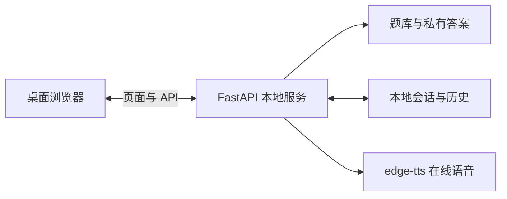

# 当前架构

[项目总览](../../README.md) · [接口说明](api.md) · [开发与验证](development.md)

应用由单个 FastAPI 服务托管原生 HTML/CSS/JavaScript 前端，以本地 JSON 文件保存题库、会话和历史记录。前端无框架、无构建步骤；运行范围是个人 Windows 桌面浏览器，不提供多人账户隔离或云同步。

## 运行结构

服务绑定 `127.0.0.1:38761`。首页 `/` 及下述应用页面路径返回同一前端入口，静态目录仅包括 `/frontend` 和本机已导入的模考原卷题面图片 `/mock-pages`；后者只在启动时目录存在的情况下挂载。没有模考材料时服务仍正常启动。题库 JSON、答案键、源稿、审阅记录及用户数据通过后端管理，不作为静态目录公开。

## 页面路径与浏览器导航

同一端口承载全部页面。`view-navigation.js` 通过 History API 保存页面切换，浏览器返回、前进恢复对应页面；后端只为明确的页面路径提供入口，未匹配的 API、静态资源和私有文件路径仍返回 404。

| 路径 | 页面与恢复方式 |
| --- | --- |
| `/` | 首页 |
| `/practice/{section}` | 阅读、听力、写作或口语的专项设置 |
| `/practice/{section}/run/{id}`、`/exam/{section}/{id}` | 当前专项或整科练习，仅恢复当前标签页内仍保留的同一轮作答 |
| `/history`、`/history/{category}/{id}` | 答题记录及已归档复盘；分类为 `practice`、`mock`、`test` |
| `/tests`、`/tests/{id}` | 综合测验设置及服务端会话 |
| `/mocks`、`/mocks/{paper}`、`/mocks/sessions/{id}` | 模考试卷选择、设备检查及服务端会话 |

题号切换和考试阶段推进不添加浏览器历史；恢复服务端会话时显示最新阶段，不能通过返回修改已提交阶段。普通练习交卷后，以归档复盘地址替换本轮作答地址，避免返回后重复交卷。答案和录音不写入 URL 或浏览器历史状态。

离开作答页会停止提示音与录音；模考和综合测验先保存答案及录音，保存失败则保留当前页面和浏览器历史位置，供重试。普通练习通过返回、前进保留当前轮次，开始另一轮或打开其他作答／复盘后不再保证旧轮次可恢复。刷新或重新打开普通练习链接时，专项回到设置，整科回到首页，并提示重新开始，不自动重新抽题。已归档复盘和服务端会话支持直接打开与刷新，原有截止时间不重置。

## 模块分工

### 前端

脚本由 [index.html](../../frontend/index.html) 按依赖顺序以 `defer` 加载，各组件通过工厂函数、回调或页面事件协作。

| 模块 | 职责 |
| --- | --- |
| [app.js](../../frontend/app.js) | 练习状态、题面渲染、计时、交卷、录音上传及组件接线；综合测验复用其答题与复盘界面 |
| [adaptive-test.js](../../frontend/adaptive-test.js) | 综合测验方案选择、会话恢复、阶段保存与提交 |
| [mock-exam.js](../../frontend/mock-exam.js) | ETS 固定模考的设备检查、说明页、逐阶段作答、录音和整卷复盘 |
| [history.js](../../frontend/history.js) | 记录分类、日期筛选、分页、详情及记录管理 |
| [practice-sentence.js](../../frontend/practice-sentence.js)、[practice-review.js](../../frontend/practice-review.js) | 造句词块交互，以及按材料分组的成绩与复盘展示 |
| [practice-recorder.js](../../frontend/practice-recorder.js)、[audio-cache.js](../../frontend/audio-cache.js) | 练习麦克风与转写；共享提示音缓存、角色配音和浏览器语音回退 |
| [view-navigation.js](../../frontend/view-navigation.js) | 页面路径、浏览器历史与顶层视图切换；内容恢复、离开保存和资源清理由各流程负责 |

练习与模考各自管理作答状态。组件接收所需数据和回调，不直接接管其他流程的计时或归档。样式按首页、设置、练习、复盘、模考、测验和历史分文件维护，具体约定见[设计文档](../../DESIGN.md)。

### 后端

| 模块 | 职责 |
| --- | --- |
| [app.py](../../backend/app.py)、[models.py](../../backend/models.py) | FastAPI 入口、静态资源、取题与提交接口、语音合成及请求模型 |
| [question_store.py](../../backend/question_store.py) | 题库读取、按 ID 查询、完整材料抽取与固定卷选择；题目、答案和清单在进程内延迟加载并缓存，公开查询返回副本 |
| [exam_service.py](../../backend/exam_service.py)、[scoring.py](../../backend/scoring.py) | 提交范围校验、逐题评分、参考答案及反馈汇总 |
| [mock_exam.py](../../backend/mock_exam.py) | ETS 卷读取、模考状态、阶段与单题截止时间、录音和完成结果 |
| [adaptive_test.py](../../backend/adaptive_test.py) | 原创综合测验组卷、阅读／听力模块路由、阶段计时及完成归档 |
| [history.py](../../backend/history.py) | 练习快照、历史查询、录音、材料提交次数及记录重置 |
| [archive_io.py](../../backend/archive_io.py)、[archive_index.py](../../backend/archive_index.py) | JSON 原子写入、归档校验、错误诊断及可重建的内存索引 |
| [logging_config.py](../../backend/logging_config.py) | 控制台日志和静态资源请求过滤 |

## 作答与数据流

1. **专项／整科练习**：浏览器取题并保留本轮题号；提交时服务端校验、评分，保存题面与结果快照，再返回参考答案和解析。专项提交按原题号评分，不重新抽题；相同提交 ID 和内容的重试不重复归档。抽题单位与计时规则见[专项规格](../../specs/exam_aligned_practice_design.md)。
2. **综合测验**：服务端按完整材料创建当前阶段，阅读和听力各自在第一模块后决定第二模块选材。阶段提交后锁定，整卷完成后写入测验历史；答案键在完成前留在服务端。蓝图、档位和路由见[测验规格](../../specs/adaptive-tests.md)。
3. **ETS 模考**：使用独立题库，按设备检查、阅读双模块、听力双模块、写作、口语推进。说明页确认后开始计时；阅读与造句可在当前阶段内回看，听力与口语逐题向前。整卷完成才开放答案和录音复盘，流程与限时依据见[模考说明](../question-bank/mock-isolation.md)。

普通练习未提交的答案与录音保留在当前页面。模考与综合测验由服务端保存进度和截止时间；浏览器保留恢复入口，综合测验另有本地文字草稿。恢复会话不重置计时，页面关闭后也不能继续播放音频或录音。

## 存储与归档

数据根目录由启动前的 `TOEFL_DATA_DIR` 指定，默认是项目的 `artifacts/`。当前验证输出位于 `artifacts/qa/`，已停用的开发产物和旧备份移至 `tmp/`；目录用途与保留规则见 [artifacts 目录说明](artifacts.md)。

| 相对数据根目录的路径 | 保存内容 |
| --- | --- |
| `practice-history/` | 单项训练与综合测验的完成快照、录音，以及 `.repeat-reset` 抽题权重重置标记 |
| `mock-sessions/` | 模考会话及录音；已完成会话直接作为模考历史读取 |
| `test-sessions/` | 综合测验的阶段、题面、路由、作答和截止时间 |

JSON 文件是持久数据来源，内存索引仅加速历史列表、模考归档及材料提交次数读取。写入先生成临时文件，再替换目标；存储模块负责锁和索引失效。读取失败与内容损坏分别报告可定位的文件标识，不静默返回空历史，也不在读取时修复文件。

历史按完成时间倒序显示，页面每页 10 条，日期筛选使用浏览器本地时区。「重置概率」保留记录与录音，将既有提交排除出降权统计；新提交重新累计。「全部清空」删除所有分类的已归档记录与录音并重置统计，不受当前筛选限制，保留进行中或已放弃的模考。诊断与恢复流程见[历史管理规范](../../specs/history-management.md#archive-diagnostics-and-recovery)。

复盘可显示与历史题面和参考答案仍一致的新版学习解析；历史答案、成绩、原始反馈及录音不会因此改写。题库内容变更须经过[题库维护流程](../../question_bank/README.md)。

## 音频与录音

- 提示音由 `edge-tts` 联网生成，接口直接返回临时 MP3 字节。浏览器按材料预加载，最多同时准备两段；同轮相同材料与重播共用音频。提交成功或离开对应流程时取消请求、释放缓存，不持久写入提示音文件。
- 音色按材料独立随机：美式约 80%、英式和澳式各约 10%，男女声约各半。同轮重播保持同一音色；这些比例是训练配置。双人对话按角色逐轮配音，角色音色保持一致，不朗读角色名称。
- 在线合成失败时，浏览器仅使用同地区、同名说话人的音色；找不到匹配音色会提示失败，不自动换成其他口音或性别。音色定义与分段规则见 [audio-cache.js](../../frontend/audio-cache.js)，请求允许值见 [models.py](../../backend/models.py)。
- 口语使用 `MediaRecorder` 录音，可用时尝试浏览器语音识别。练习评分依据文字，不评估发音、语调或流利度。专项／整科提交会等待录音收尾，再上传至本机服务；未上传成功的录音仍只存在于当前页面。
- 模考逐题保存录音；录音到时停止后有 10 秒上传宽限，不能延长作答或覆盖已保存录音。放弃、离开或进入复盘时停止麦克风并释放临时资源；上传失败可重试。个人录音与可释放的提示音缓存分别管理。
